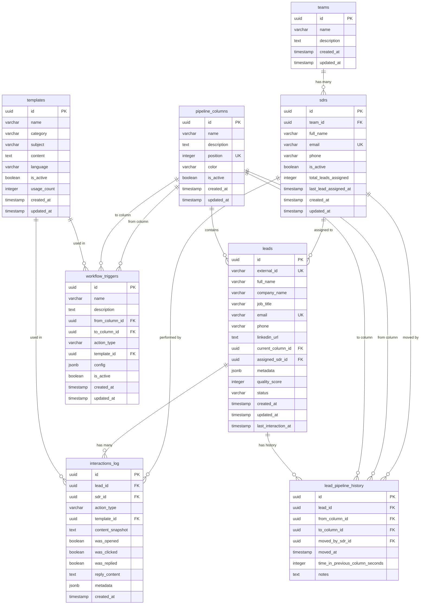
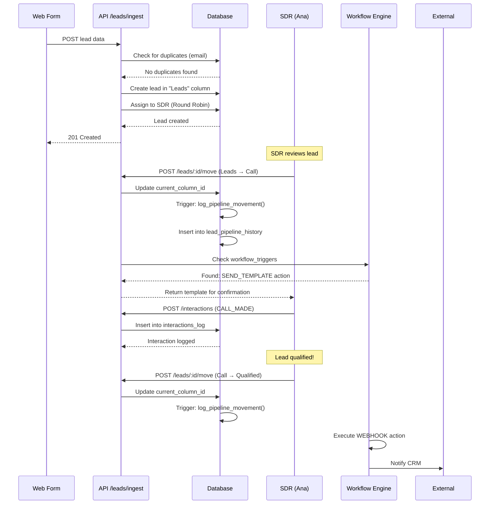

# Entity Relationship Diagram - Inside Sales Pipeline

This document provides a visual representation of the database schema and relationships between entities.

---

## Database Overview

The Inside Sales Pipeline system is built on **PostgreSQL 14+** with the following core components:

- **Team & User Management**: Teams and SDRs (Sales Development Representatives)
- **Pipeline Structure**: Dynamic columns (stages) configurable by managers
- **Lead Management**: Core lead entity with flexible JSONB metadata
- **Workflow Automation**: Trigger-based actions on pipeline movements
- **Messaging System**: Templates with placeholder support
- **Audit Trail**: Complete history of interactions and movements

---

## Entity Relationship Diagram



---

## Key Relationships

### 1. Team → SDR → Lead
- **One team** has **many SDRs**
- **One SDR** is assigned **many leads**
- Enables team-based reporting and lead distribution

### 2. Pipeline Column → Lead
- **One pipeline column** contains **many leads**
- Leads move through columns as they progress
- Column positions define the visual order in the UI

### 3. Lead → Pipeline History
- **One lead** has **many history entries**
- Tracks every movement between columns
- Calculates time spent in each stage for analytics

### 4. Workflow Trigger → Template
- **One workflow trigger** can reference **one template**
- Triggered when lead moves from `from_column` to `to_column`
- Supports multiple action types (SEND_TEMPLATE, WEBHOOK, etc.)

### 5. Lead → Interactions Log
- **One lead** has **many interactions**
- Complete audit trail of all SDR activities
- Tracks engagement metrics (opened, clicked, replied)

---

## Cardinality Summary

| Relationship | Type | Description |
|--------------|------|-------------|
| Team → SDR | 1:N | One team has many SDRs |
| SDR → Lead | 1:N | One SDR manages many leads |
| Pipeline Column → Lead | 1:N | One column contains many leads |
| Lead → Pipeline History | 1:N | One lead has many history entries |
| Lead → Interactions | 1:N | One lead has many interactions |
| Template → Workflow Trigger | 1:N | One template used in many triggers |
| Pipeline Column → Workflow Trigger | 2:N | Two columns define one trigger (from/to) |

---

## Indexes & Performance

### Primary Indexes

All tables use **UUID** primary keys for:
- Global uniqueness across distributed systems
- Security (non-sequential IDs)
- Future scalability

### Critical Indexes

#### Lead Search & Filtering
```sql
-- Fast email lookups (deduplication)
CREATE INDEX idx_leads_email ON leads(email);

-- External ID lookups (API integrations)
CREATE INDEX idx_leads_external_id ON leads(external_id);

-- Pipeline filtering
CREATE INDEX idx_leads_current_column ON leads(current_column_id);

-- SDR workload queries
CREATE INDEX idx_leads_assigned_sdr ON leads(assigned_sdr_id);

-- Full-text search
CREATE INDEX idx_leads_fulltext ON leads USING GIN(
    to_tsvector('portuguese', 
        COALESCE(full_name, '') || ' ' || 
        COALESCE(company_name, '') || ' ' || 
        COALESCE(job_title, '')
    )
);
```

#### JSONB Metadata Search
```sql
-- Flexible metadata queries (UTMs, form responses, etc.)
CREATE INDEX idx_leads_metadata ON leads USING GIN(metadata);
```

**Example Queries:**
```sql
-- Find leads from LinkedIn campaign
SELECT * FROM leads 
WHERE metadata @> '{"utm_source": "linkedin"}';

-- Find high-budget leads
SELECT * FROM leads 
WHERE metadata @> '{"budget": "high"}';

-- Find leads from specific industry
SELECT * FROM leads 
WHERE metadata->>'industry' = 'SaaS';
```

#### Analytics Indexes
```sql
-- Pipeline movement analytics
CREATE INDEX idx_pipeline_history_lead ON lead_pipeline_history(lead_id, moved_at DESC);

-- Column performance metrics
CREATE INDEX idx_pipeline_history_column ON lead_pipeline_history(to_column_id, moved_at DESC);

-- Interaction timeline
CREATE INDEX idx_interactions_lead ON interactions_log(lead_id, created_at DESC);
```

---

## Constraints & Data Integrity

### Unique Constraints

| Table | Column(s) | Purpose |
|-------|-----------|---------|
| `leads` | `email` | Prevent duplicate leads by email |
| `leads` | `external_id` | Prevent duplicate imports from same source |
| `sdrs` | `email` | Unique SDR accounts |
| `pipeline_columns` | `position` | Enforce ordered columns |
| `workflow_triggers` | `from_column_id, to_column_id, action_type` | One action per movement |

### Foreign Key Constraints

All foreign keys use appropriate cascade rules:

- **ON DELETE CASCADE**: Used for dependent data (e.g., `lead_pipeline_history` when lead is deleted)
- **ON DELETE SET NULL**: Used for references that should remain (e.g., SDR deletion doesn't delete leads)

### Check Constraints

```sql
-- Quality score must be 0-100
ALTER TABLE leads ADD CONSTRAINT check_quality_score 
    CHECK (quality_score >= 0 AND quality_score <= 100);

-- Email format validation (basic)
ALTER TABLE leads ADD CONSTRAINT check_email_format 
    CHECK (email ~* '^[A-Za-z0-9._%+-]+@[A-Za-z0-9.-]+\.[A-Za-z]{2,}$');
```

---

## Automatic Triggers

### 1. Updated At Timestamp

All tables with `updated_at` automatically update on modification:

```sql
CREATE TRIGGER update_leads_updated_at BEFORE UPDATE ON leads
    FOR EACH ROW EXECUTE FUNCTION update_updated_at_column();
```

### 2. Pipeline Movement Logging

Automatically logs lead movements:

```sql
CREATE TRIGGER track_pipeline_movement BEFORE UPDATE ON leads
    FOR EACH ROW EXECUTE FUNCTION log_pipeline_movement();
```

**What it does:**
- Detects when `current_column_id` changes
- Calculates time spent in previous column
- Creates entry in `lead_pipeline_history`
- Updates `last_interaction_at` timestamp

---

## Data Flow Example

### Lead Journey: Form Submission → Qualified



---

## Extensibility Points

### 1. Dynamic Pipeline Columns

Managers can add new columns without schema changes:

```sql
INSERT INTO pipeline_columns (name, description, position, color)
VALUES ('Demo Scheduled', 'Leads with confirmed demo', 6, '#06B6D4');
```

### 2. Flexible Metadata

The `metadata` JSONB field supports any structure:

```json
{
  "utm_source": "linkedin",
  "custom_field_1": "value",
  "nested": {
    "data": "supported"
  },
  "arrays": ["also", "work"]
}
```

### 3. Configurable Workflows

New automation rules via simple INSERT:

```sql
INSERT INTO workflow_triggers (
    name, from_column_id, to_column_id, action_type, config
) VALUES (
    'Send Slack Notification',
    'c0000005-0000-0000-0000-000000000005', -- Qualified
    NULL, -- Any destination
    'WEBHOOK',
    '{"webhook_url": "https://hooks.slack.com/...", "method": "POST"}'::jsonb
);
```

---

## Performance Considerations

### Query Optimization

1. **Always use indexes** for WHERE clauses on:
   - `email`, `external_id` (lookups)
   - `current_column_id` (filtering)
   - `assigned_sdr_id` (SDR workload)
   - `created_at`, `last_interaction_at` (time-based queries)

2. **JSONB queries** use GIN index:
   ```sql
   -- Fast (uses index)
   WHERE metadata @> '{"utm_source": "linkedin"}'
   
   -- Slower (still indexed, but less efficient)
   WHERE metadata->>'utm_source' = 'linkedin'
   ```

3. **Full-text search** for lead names/companies:
   ```sql
   SELECT * FROM leads
   WHERE to_tsvector('portuguese', full_name || ' ' || company_name)
         @@ to_tsquery('portuguese', 'tech & solutions');
   ```

### Partitioning Strategy (Future)

For high-volume systems (>1M leads), consider partitioning:

- **leads**: Partition by `created_at` (monthly/yearly)
- **interactions_log**: Partition by `created_at` (monthly)
- **lead_pipeline_history**: Partition by `moved_at` (quarterly)

---

## Database Size Estimates

Based on average data:

| Table | Avg Row Size | 10K Leads | 100K Leads | 1M Leads |
|-------|--------------|-----------|------------|----------|
| `leads` | ~2 KB | 20 MB | 200 MB | 2 GB |
| `interactions_log` | ~1 KB | 50 MB | 500 MB | 5 GB |
| `lead_pipeline_history` | ~500 B | 25 MB | 250 MB | 2.5 GB |
| **Total** | - | **~100 MB** | **~1 GB** | **~10 GB** |

*Estimates include indexes and JSONB metadata*
